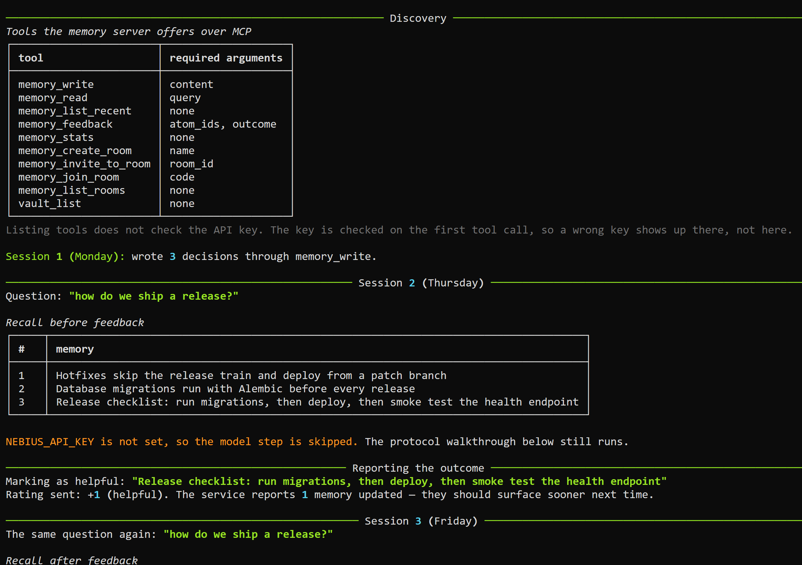

# Mnemoverse MCP Agent

> Agent memory over the Model Context Protocol: discover the tools, write, recall, and tell the service how the recall worked out.

This example imports no memory library at all. It starts the Mnemoverse memory
server as a subprocess, speaks MCP to it over stdio, and drives the whole loop
through protocol calls, so what you read is the protocol rather than a wrapper
around it.

The run has four parts. First discovery: `list_tools()` prints every tool the server
offers and the arguments each one requires. Then `memory_write` records a handful of
decisions. Then `memory_read` recalls them in a later session and a model on Nebius
Token Factory answers from what came back. Finally `memory_feedback` reports which
recalled note actually helped, and the same question is asked again so you can see
where that note lands the second time.

In the run pictured above the note that was marked helpful moved from third place to
first, and the two notes above it moved down. Recall is ranked, and the outcome report
is what changes the ranking.

## Features

- **Tool discovery over stdio**: the run starts by listing the server's tools and their required arguments, so nothing about the protocol is hidden.
- **The full memory loop through MCP**: `memory_write`, `memory_read` and `memory_feedback`, with no memory SDK imported.
- **A visible before and after**: the recall order is printed on both sides of the feedback call, plus a table of which notes changed position.
- **Runs without a model key**: the protocol walkthrough is the point, so the answering step is optional and the run says when it skips it.
- **Its own namespace**: memories go to `project:release-assistant-mcp` by default, and `MNEMOVERSE_DEMO_DOMAIN` overrides it, so the notes this example writes stay separate from other notes on the key.
- **Pinned server version**: the npm package is pinned in the launch arguments, because an unpinned `npx -y` can run an older copy already installed on the machine.

## Tech Stack

- **Python**: core language, 3.10 or newer
- **MCP Python SDK** (`mcp`): stdio client, tool discovery and tool calls
- **Mnemoverse memory server** (`@mnemoverse/mcp-memory-server`): the MCP server, launched with npx, MIT licensed
- **Nebius Token Factory**: model access for the answering step, through the OpenAI-compatible API
- **Rich**: tables and panels in the terminal
- **python-dotenv**: environment loading

## Workflow

```text
npx -> memory server          subprocess speaking MCP over stdio
        |
   list_tools()               ten tools and their required arguments
        |
   memory_write               decisions recorded, once per namespace
        |
   memory_read                recall, ranked
        |
   Nebius model               answer built only from the recalled notes
        |
   memory_feedback            "this one helped", outcome 1.0
        |
   memory_read                same question, new order
```

## Prerequisites

- Python 3.10 or newer
- Node.js 18 or newer, because the memory server is an npm package started with `npx`
- [uv](https://github.com/astral-sh/uv) or pip
- API keys:
  - [Mnemoverse](https://console.mnemoverse.com) for memory. There is a free tier, see the [pricing page](https://mnemoverse.com/pricing).
  - [Nebius Token Factory](https://tokenfactory.nebius.com) for the model. Optional: without it the walkthrough runs and the answering step is skipped.

## Getting Started

### Environment Variables

Copy `.env.example` to `.env` and fill it in:

```env
MNEMOVERSE_API_KEY="your_mnemoverse_api_key_here"
NEBIUS_API_KEY="your_nebius_api_key_here"
```

`MNEMOVERSE_DEMO_DOMAIN` is optional. It sets the namespace the example writes into,
which is useful when a key has already run this example and you want to watch the
first move again.

### Installation

1. **Clone the repository:**

   ```bash
   git clone https://github.com/Arindam200/awesome-ai-apps.git
   cd awesome-ai-apps/mcp_ai_agents/mnemoverse_mcp_agent
   ```

2. **Create and activate a virtual environment:**

   ```bash
   python -m venv .venv
   source .venv/bin/activate  # On Windows, use: .venv\Scripts\activate
   ```

3. **Install dependencies:**

   - **Using `uv` (recommended):**

     ```bash
     uv sync
     ```

   - **Using `pip`:**

     ```bash
     pip install "mcp>=2.2.0" openai python-dotenv rich
     ```

## Usage

```bash
python main.py
```

The first run writes the decisions and then walks the loop. Later runs skip the
writing and go straight to the question, because the memories are already there. If
no position changes on a later run, that is the ranking from the earlier run still in
place, and the run says so and tells you how to start fresh.

One detail worth knowing while you set this up: listing the tools does not check the
API key. The key is checked on the first tool call, so a wrong key produces a clear
error there rather than at startup.

## Project Structure

```text
mnemoverse_mcp_agent/
├── assets/
│   └── demo.png          # Screenshot of a run
├── .env.example          # Environment variable template
├── main.py               # Discovery, write, read, feedback
├── pyproject.toml        # Dependencies
└── README.md             # This file
```

## About Mnemoverse

Mnemoverse is a hosted memory service for AI agents. Its MCP server and its Python
SDK are MIT licensed; the memory engine they talk to is a hosted service with a free
tier, and Enterprise customers can self-host it by agreement. The server exposes ten
tools, which the discovery step in this example prints in full.

Disclosure: I work on Mnemoverse.

## Notes

- The screenshot above is a first run on a fresh namespace and without a Nebius key, so it shows the protocol walkthrough with the answering step skipped.
- The ranking positions shown depend on your own data. What the example demonstrates is that an outcome report changes the order, not any particular set of positions.
- The MCP Python SDK exposes some fields under different names than the wire format, for instance `input_schema` against `inputSchema`, and the 1.x and 2.x lines differ from each other too. The example reads whichever the installed version has, and `pyproject.toml` declares the 2.x floor.

## Contributing

Contributions are welcome. Please open a Pull Request. See
[CONTRIBUTING.md](../../CONTRIBUTING.md) for the guidelines.

## License

This project is licensed under the MIT License, see the [LICENSE](../../LICENSE) file
for details.

## Acknowledgments

- [Model Context Protocol](https://modelcontextprotocol.io) for the protocol and the Python SDK.
- [Nebius Token Factory](https://tokenfactory.nebius.com) for model access.
- [Rich](https://github.com/Textualize/rich) for the terminal output.
